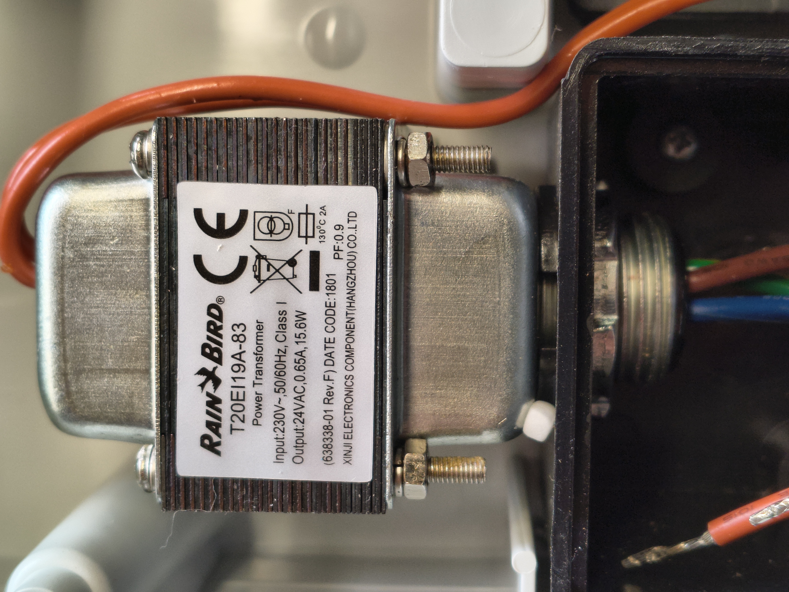

# Lawn Sprinkler Controller
# RAINBIRD ESP-RXZe

## 1. Description

### 1.1 External description

**EVs wiring**

**Electronic board removed**

**User manual**
RAINBIRD - Programmateur Arrosage ESP-RZ - User manual Fr.pdf

### 1.2. Main components

**Electronic card - Rear view**

**Electronic card - Component side**
.jpg)

- **Micro controller**
MC9S08LL64CLH : 8-bit microcontroller from the NXP S08 series  
8-Bit S08 Central Processor
Speed of 40MHz enabling quick processing
64KB Flash Memory for program storage
4KB RAM for data handling
Multiple connectivity options including I2C, SCI, SPI interfaces
Integrated peripherals such as LCD Driver, LVD, POR, PWM, WDT
37 programmable I/O pins for versatile use
Internal 12-bit analog-to-digital converters (8 channels)
Operational over a wide voltage range (1.8V to 3.6V)
Built-in oscillator for system clock generation
Supply Device Package: 64-LQFP (10x10)  

- **24 V Transformer** 
RainBird T20EI 19A-83
Input 230V : Output 24V AC, 0,65A, 15,6W  
Output no charge : 19,62 V measured  

### Schematics
